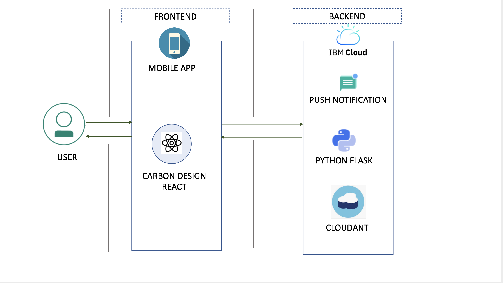
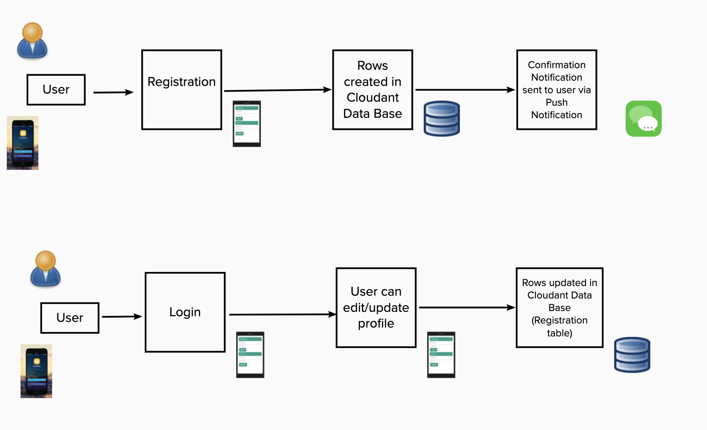
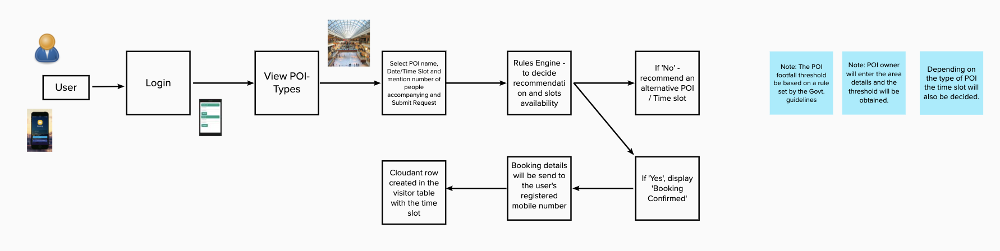
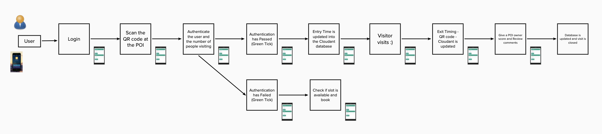

# Sarathi - We help you plan your visits during the pandemic!

## Contents

1. [Short description](#short-description)
1. [Demo video](#demo-video)
1. [The architecture](#the-architecture)
1. [Project description](#project-description)

## Short description

### What's the problem?

We are considering a post lockdown scenario where we might have mass gatherings at particular places like super market, temples, gardens or any other point of interest. There could be alternate options for all of these places where the number of people visiting might be relatively low but the crowd might not be aware of those options and would end up being at one particular place in large number (For eg: crowd gathering at Phoenix Market City would be more when compared to any other malls because people are not aware of any other option with small crowd)

### How can technology help?

We can have a mobile application to achieve the crowd distribution and also understand the number of users present at a particular location.

### The idea

The mobile application will help the user to plan his visit to a particular place if in case there is small crowd. But if there is large crowd gathering in that particular place then the app will help them to plan for an alternate place by recommending suitable option so that the social distancing is followed strictly.

## Demo video

[

## The architecture

## Project description

User Registration and login:

User booking:

User at POI:

List of contributors who participated in this project.

1. Abhishek Shetty
1. Amol Deshpande
1. Binu Midhun
1. Dipali Chatterjee
1. Ritu Maheshwari
