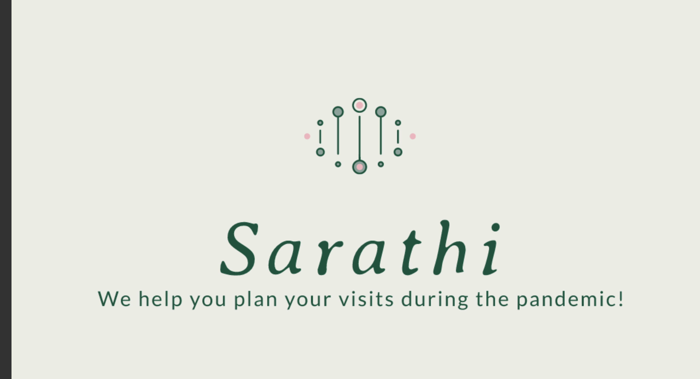
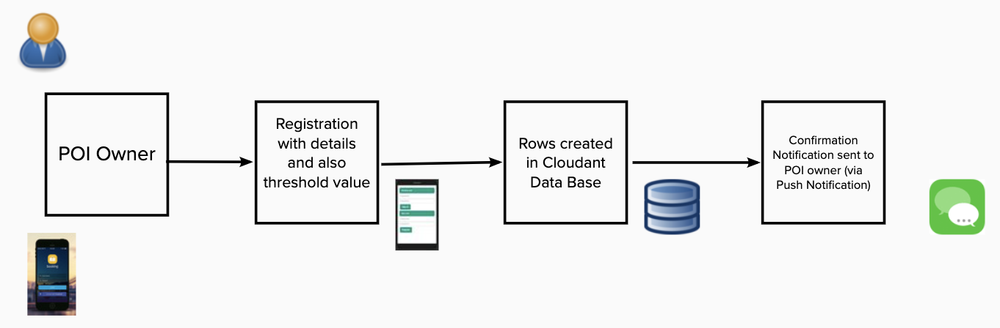
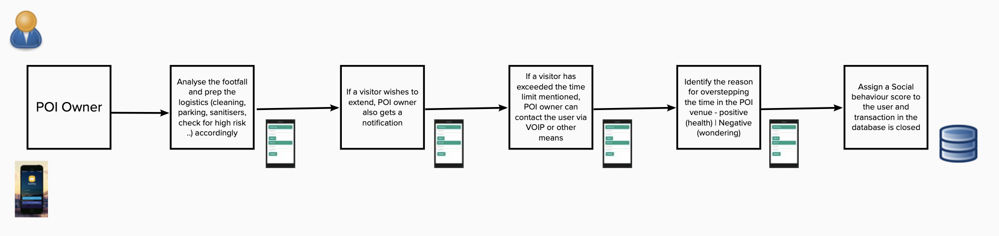
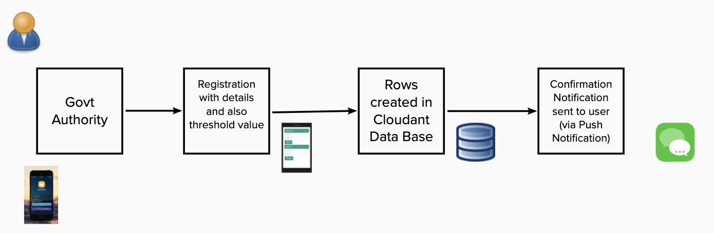
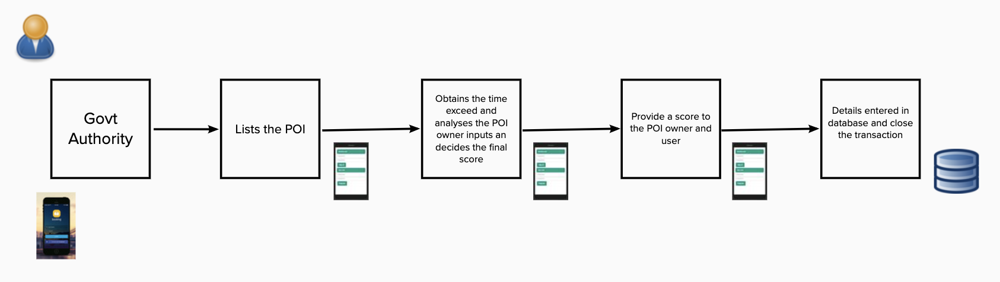

# Sarathi - We help you plan your visits during the pandemic!



## Contents

1. [Short description](#short-description)
1. [Demo video](#demo-video)
1. [Long description](#long-description)
1. [Project description](#project-flow)
1. [Project roadmap](#project-roadmap)
1. [The architecture](#the-architecture)

## Short description

### What's the problem?

We are considering a post lockdown scenario where we might have mass gatherings at particular places like super market, temples, gardens or any other point of interest. There could be alternate options for all of these places where the number of people visiting might be relatively low but the crowd might not be aware of those options and would end up being at one particular place in large number (For eg: crowd gathering at Phoenix Market City would be more when compared to any other malls because people are not aware of any other option with small crowd)

### How can technology help?

We can have a mobile application to achieve the crowd distribution and also understand the number of users present at a particular location.

### The idea

The mobile application will help the user to plan his visit to a particular place if in case there is small crowd. But if there is large crowd gathering in that particular place then the app will help them to plan for an alternate place by recommending suitable option so that the social distancing is followed strictly.

## Demo video

[

## Long description

**Personas of this app are**

1. User - Citizens

1. POI (Point of Interests) Admin

1. POI Owner - QR code for Walk-ins

**WHO**, *WHAT*, ```WOW```

[HILLS](#short-description)

**A user** [can](#short-description) *register, get visibility and crowd heat map, give safety ratings to the places of interest (POI) (shopping malls, religious establishments, shops, restaurants etc), in a locality, book a suitable time slot in the POI of choice* ```to visit with friends and family, ```[on an](#short-description) ```intuitive mobile which helps  rekindle social interactions maintaining health regulations of occupancy in public places.```

**A POI Owner** [can](#short-description) *monitor (n) number of visitors, identify visitors who have overstepped the time slot* [and](#short-description) ```initiate steps to provide them the right available alternatives without delay and report back to the government appointed authority about regular offenders.```

**A Government administrative appointee** [can](#short-description) *rapidly deploy the system to augment the stressed mainstream POI infrastructure in the crisis situation* ```aiding returning to normalcy post lockdown while maintaining necessary health precautions.```

**Scores:**

* Social behavioural score
* POI Risk Score


**Assumptions**

1. GPS / Mobile Data will be enabled

1. POI Owner will decide based on the regulations from the government on the footfall allowed and will keep this data updated in Sarathi App based on revised government regulations.
(For example, retail floor area of 10,00,000 sq. ft. mall can have at the max 15000 people at a given time)

**Best Case Scenario**

1. User will register in App (provide contact details, personal details like age, gender, etc)

1. User will login to the application with the username and password.

1. From the user interface select which POI-TYPE, date/time slot (Temple, Park, Malls) - for example if the user selects malls

1. UI displays all the nearest malls on recommendation basis (sorted based on proximity, risk factor, date/time)

1. Choose POI name (example Phoenix Market City)

1. POI details will be displayed on screen with real time confirmed registrations and waiting lists.

1. On successful submission, a confirmation message will be received by the user


## Project Flow

**User Registration and login**


**User booking**


**User at POI**


## Project roadmap

* The Sarathi App can be integrated with data from Government Of India Arogya Setu App, and the risk score of the user can be calculated before allocating a POI.

* GPS data will be available and hence a risk score can be generated for a person based on his travel history to containment zones or hot spots. This score will be very useful for security of other visitors. Based on the reservation for a time slot the total risk score of a POI can be generated.

We plan to implement the below persona flows in the upcoming iterations:

**POI Owner Registration**



**POI Owner Flow**



**Government Authority Registration**



**Government Authority Flow**




## The architecture


List of contributors who participated in this project.

1. Dipali Chatterjee
1. Binu Midhun
1. Amol Deshpande
1. Ritu Maheshwari
1. Abhishek Shetty
